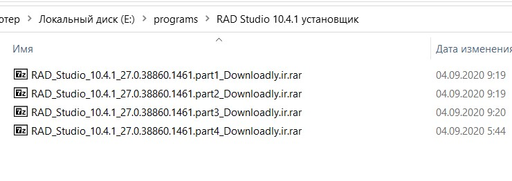
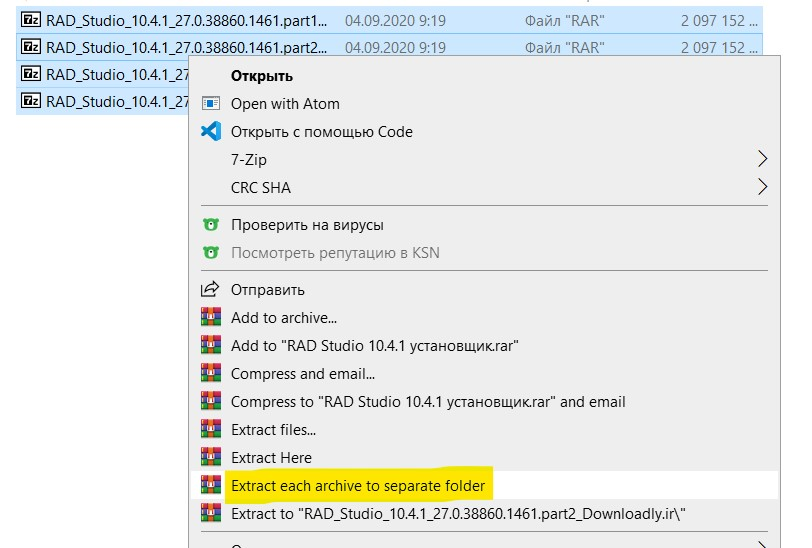
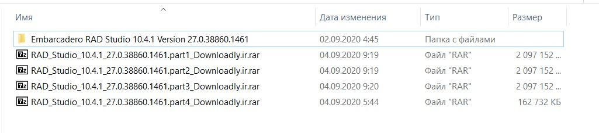
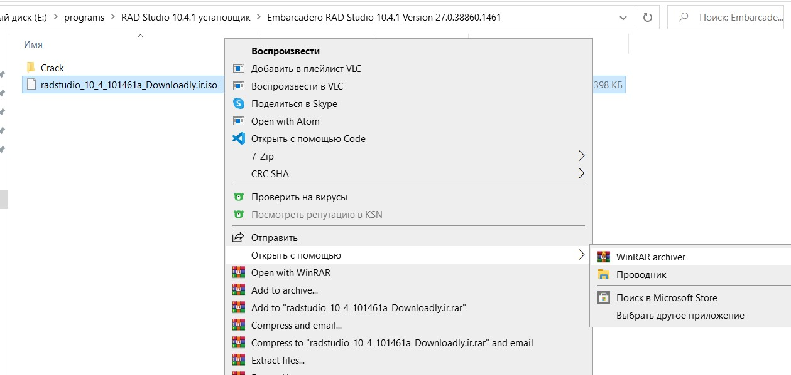
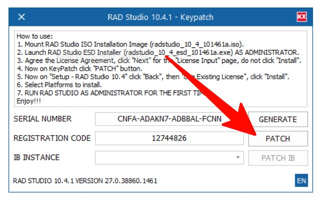

# Инструкция по установке Delphi 10.4

## 1. Скачиваю архивы по ссылкам:

- [Первый архив](https://dl.downloadly.ir/Files/Software/RAD_Studio_10.4.1_27.0.38860.1461.part1_Downloadly.ir.rar)

- [Второй архив](https://dl.downloadly.ir/Files/Software/RAD_Studio_10.4.1_27.0.38860.1461.part2_Downloadly.ir.rar)

- [Третий архив](https://dl.downloadly.ir/Files/Software/RAD_Studio_10.4.1_27.0.38860.1461.part3_Downloadly.ir.rar)

- [Четвертый архив](https://dl.downloadly.ir/Files/Software/RAD_Studio_10.4.1_27.0.38860.1461.part4_Downloadly.ir.rar)

## 2. Далее нужно смонтировать все 4 архива в один образ iso.
Монтировать нужно при помощи архиватора `winrar` !!!
Из личного опыта знаю, что 7zip так не умеет и ничего не получится. 
Используйте именно winrar. скачать его можно [здесь](https://www.rarlab.com/rar/winrar-x64-600.exe)

## 3. Выделяю все скачанные архивы и нажимаю кнопку “Extract each archive to separate folder”.

Далее у нас появляется папка, где находится смонтированный образ iso.

## 4. Заходим в папку Embarcadero RAD Studio..., нажимаем правой кнопкой мыши по .iso -> открыть с помощью winrar

## 5. Далее оттуда запускаем файл .exe `С ПОМОЩЬЮ АДМИНИСТРАТОРА!!!!!`

Cоглашаемся с лицензией и ждем кнопку "далее".

## 6. !!! ДАЛЕЕ `НЕ НАЖИМАЕМ` КНОПКУ УСТАНОВКИ!!!
а запускаем файл patch.exe в папке crack. Нажимаем кнопку PATCH

## 7. Теперь в окне установки делфи нажимаем кнопку “назад” (back).

## 8. Нажимаем  "Use Existing License", и "Install".
далее выбираем нужные дополнения  и ждем установку.

## 9. После установки ПЕРВЫЙ запуск приложения необходимо произвести от имени администратора!! Это важно!
Готово!!!!
Enjoy!!!

